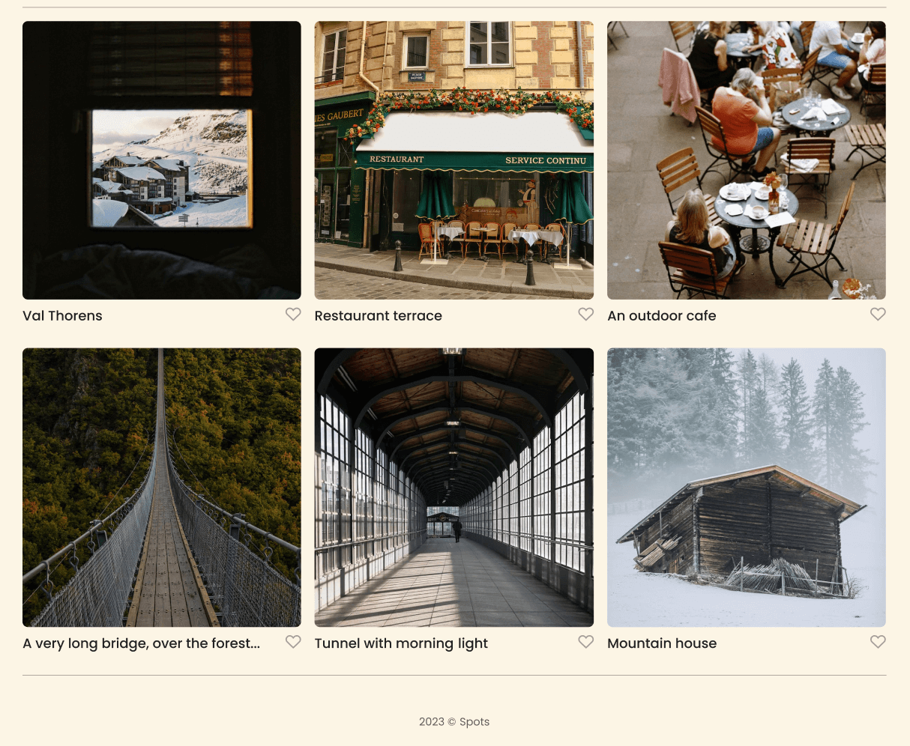

# Project 3: Spots

### Overview

- Intro
- Project Description
- Technologies Used
- Figma
- Images
- Link to GitHub Pages
- Project Video

**Intro**

This project is made so all the elements are displayed correctly on popular screen sizes. We recommend investing more time in completing this project, since it's more difficult than previous ones.

**Project Description**

Spots is a responsive web page that adjusts is layout based on screen size. Whether you are looking at the application through a mobile phone or a large desktop screen, the design will remain cohesive and organized. The project shows a profile and a layout of cards that adjusts column and row length based on your screen.

**Technologies Used**

-HTML
-CSS
-GitHub Pages

- **Figma**

- [Link to the project on Figma](https://www.figma.com/file/BBNm2bC3lj8QQMHlnqRsga/Sprint-3-Project-%E2%80%94-Spots?type=design&node-id=2%3A60&mode=design&t=afgNFybdorZO6cQo-1)

**Images**

The way you'll do this at work is by exporting images directly from Figma — we recommend doing that to practice more. Don't forget to optimize them [here](https://tinypng.com/), so your project loads faster.

Good luck and have fun!

**Link to GitHub Pages**

Here is the link to the live demo.
https://fredsmith2.github.io/se_project_spots/

**Project Video**
Here is the link to the project video.
https://drive.google.com/file/d/18KtbK_i7zlQaRCEsoySEOJ0PSovy9aM5/view?usp=drive_link
